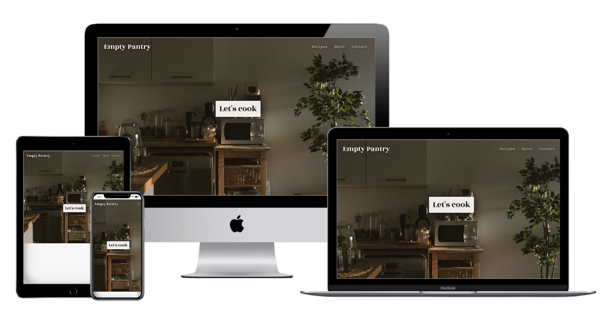

# Empty Pantry
### Find a recipe with the last of your ingredients in the pantry

## Objective: To reduce food waste and offer inspiration to those with a bare fridge or cupboard by providing easy, affordable and healthy recipes.

##Debugging
1 Had issues with the enter button on the homepage. Initially I played with margin, and padding to try and center the button, i ended up finding bootstrap to be most effective.

# Empty Pantry
—
Empty Pantry is a resourceful site/app to find cooking inspiration to use the last of the ingredients in the cupboard or fridge, to reduce food waste and to encourage home-cooking. The recipes offer approachable instructions, there are healthy options and the recipes are cost-efficient. Using a simple API to retreive recipes from a database, Empty Pantry aims to invite users to try home-cooking and have fun! 

[You can view the live project here](https://emmasarge.github.io/emptypantry/index.html)

## Contents 
---
* UX
  * Project Goals
  * User Goals
  * Business Goals
  * User Requirements
  * Planning & Design
    * Layout & Wireframes
    * Colors
    * Fonts

* Technologies 
  
* Features
  * Current
  * Future 

* Testing 

* Bugs

* Deployment 
  * Method
  
* Credits

# UX #
---
### Project Objectives 
---
  1) Create a user-friendly recipe search site/app to inspire users to do more home-cooking.
  2) Provide a stylish and efficient user experience.
  3) Emphasise approachability of site for users to use and contact the company to share their input, increase recipes.
  4) Use a free API with a recipe data base that responds to an ingredient search. 
  5) Demonstrate my use of Vanilla Javascript, JQuery and API's whilst maintaining visual integrity. 

### User Goals 
---
As a potential user of Empty Pantry I want:
 * I want to visit a modern and clean website.  
* I want to easily navigate the website.
* I want to find a variety of recipes with a recipe search.
* I want to be able to contact the Empty Pantry to complain if there aren't enough recipes.
* I want easy access to Empty Pantry's social media so I can judge their social media presence. 
* Website that works on phone, tablet and desktop to accommodate my busy lifestyle.
* I want to feel excited to find a new recipe and to return to this website as a recipe reference.

### Business Goals
---
* The Empty Pantry website should be very user-friendly and efficient for busy people.
* Empty Pantry must be approachable and inclusive to increase return users and home-cooking and reduce food waste. 
* The Empty Pantry should provide a varity of recipes for an ingredient search and to continue to grow the recipe database.
* The Empty Pantry invites site visitors to share their input in the beta stage of the app and to share recipes to increase the recipe database. 

### User Requirements 
---
1) Responsive design for mobile/tablet/desktop.
2) Simple and intuitive layout and design of the website, UX is efficient.
3) Provides social media links.
4) Provides contact information and address.
5) Provides a very easy-to-use contact form.
6) Site works on a variety of browsers.
7) The design of the site is approachable and intuitive. 

### Planning and Design
---
## Layout & Wireframes

## Scope 

Empty Pantry is a site with featuring contemporary design and UX to provide recipes with a basic ingredient search with MealDB Api. The site is built with four responsive pages: a landing page, recipe search page, about page and contact page. The contact page is supported by EmailJs API with an automatic reply message for users to feel acknowledged after sending their initial message.

## Structure 

I plan to keep the layout of the website to be very simple with a popular hamburger style of navigation bar and footer. Each page will be clean and intuitive for the user using HTML, CSS, Bootstrap and Javascript where appropriate. 
  
## Skeleton 

The Empty Pantry site was planned out with mockup wireframes using Balsamiq. They are as follows:
 

#### Landing Page        
* [Landing page desktop](/assets/images/readme/EPdesktopHome.png)
* [Landing page tablet](/assets/images/readme/EPtabletHome.png)
* [Landing page mobile](/assets/images/readme/EPmobileHome.png)
​
#### Recipe Page
* [Recipe page desktop](/assets/images/readme/EPdesktopRecipe.png)
* [Recipe page tablet](/assets/images/readme/EPtabletRecipe.png)
* [Recipe page mobile](/assets/images/readme/EPmobileRecipe.png)
​
#### About Page
* [About page desktop](/assets/images/readme/EPdesktopAbout.png)
* [About page tablet](/assets/images/readme/EPtabletAbout.png)
* [About page mobile](/assets/images/readme/EPmobileAbout.png)

#### Contact
* [Contact page desktop](./assets/images/readme/EPdesktopContact.png)
* [Contact page tablet](./assets/images/readme/EPtabletContact.png)
* [Contact page mobile](./assets/images/readme/EPmobileContact.png)
​

### Colors

To keep a clean and natural look to the Empty Pantry Website and to enhance and idea of health, I used warm browns and greens. I was using a beige for the background but it wasn't providing enough of a contrast to benefit the UX. 

For the navbar, footer and background I used a warm off-white called #fafafa which I used in my last project, Stardust Gym, to create a clean effect and provide enough contrast with the text. I like this white because it is softer on the eyes. I do favour using white backgrounds because they look refreshing and are easy to read from. 

* Black: #1F2027
* Brown: #463e2e
* Beige: #F3ECE8
* Green: #535b31
* Off-white: #fafafa

### Images 
   * Images were really important for this project. The landing page is a huge image of a modern and warm kitchen. I used this so the site visitor can feel like they were in the kitchen getting ready to cook. For the recipe page, the images are provided from the mealDB API. The About page has a very lovely green image of cabbage as the background to create an effect of freshness, energy and simplicity. Below is a carousel of clean images of a kitchen shelf and menu items which I ensure have alt text. The Contact page has a light pattern of vegetables in the background I made to add a little interest to the page but to not be too busy against the contact form. 
 
### Fonts
* To stress contemporary design and consistency, and enhance the idea of simplicity, basics, and health, I used Courier New for the navbar, Courier new is such a familiar and old font it helps to create the idea of coming home when using this app. I used  Rozha One for headings as it is a very strong font and Raleway for most of the content on the site, again because it is easy on the eyes, clean and modern. Rozha One and Raleway were from Googlefonts. 

### Technologies Used

* [HTML5](https://en.wikipedia.org/wiki/HTML5) 

* [CSS3](https://en.wikipedia.org/wiki/CSS) for site styling

* [Bootstrap](https://getbootstrap.com/) for navbar and page layouts.

* [Javascript](https://www.javascript.com/) for interactive alerts, prompts and calling the APIs.

* [JQuery](https://jquery.com/) a javascript library.

* [MealDB](https://www.themealdb.com/api.php) the FREE recipe search API

* [EmailJs](https://www.emailjs.com/) the email API I used on the contact page.
 
* [Google Fonts](https://fonts.google.com/) for the Rozha One and Raleway fonts. 

* [Git](https://git-scm.com/)

* [Gitpod](https://www.gitpod.io/) for site development 

* [Github](https://github.com/) for site deployment.

* [Techsini](https://techsini.com/multi-mockup/index.php) for mock-up mobile/tablet/desktop images

* [Balsamiq](https://balsamiq.com) for wireframes.

### For testing:

* W3C for HTML](https://validator.w3.org/)  

* [W3C for CSS](https://jigsaw.w3.org/css-validator/)  

### Features
---
* Navigation bar
* Brand Logo
* Footer
* Responsive elements for Desktop, tablet and mobile.
* An easy contact/email form. 
* Call to action buttons
* Javascript loops
* Javascript if/else statements
* Javascript prompts
* EmailJs API
* MealDB API
* Images

### Future Features

* I would like to find a better recipe Database so that i can include the ingredients and their measurements for the recipe search. I used mealDB because it is free and doesn't require a credit card to use. 
* I would like to make the site have an ability to 'login' so that users can subscribe to a premium version of the app with more perks. 
* I also want to be able to make the ingredient search bar so that the user can enter multiple ingredients.

### Testing 
---
*  Development testing 
    * I intermittently used [Google Dev Tools](https://developers.google.com/web/tools/chrome-devtools) to double check coding for all responsive layouts.
*  Validation testing to double check coding accuracy was done with:
  1) [W3S CSS Validator](https://jigsaw.w3.org/css-validator/) 
  2) [W3S Html Validator](https://validator.w3.org/)  
  3) [Javascript Validator](https://beautifytools.com/javascript-validator.php)
  
 * Sent friends and family link to site to check on their variety of devices including:
		* Apple iPhone 6, XS, 12
		* Apple iPad 5th Generation
   		* Samsung Galaxy
		* Lenovo Laptop
		* Apple MacBook Pro
		* Apple MacBook Air

### Feedback from Testing Users

*  **FIXED**
* List pricing on the page.
* Include a blog or a page for news for the gym.
* The red text boxes on the homepage are too transparent against the zebra print for the text to be readable. **FIXED**
* The schedule pdf is not loading. **FIXED**
* Commit changes more often and be more specific. **IN PROGRESS** 

### Bugs
---
    * Navbar dropdown not collapsing cleanly for mobile and tablet settings, the links were floating in the content. Redid the navbar with bootstrap and Chrome Dev Tools.
    * Landing page was not extending fully on tablets so i changed the image to be a background image for the body in css instead, i had originally included a footer for the landing page which the gap initially helped but the footer wasn't necessary and took away from the effect of creating an environment for the user.

### Deployment 
---
#### GitHub Pages

To deploy this project with Github:
1) On Github go to the Empty Pantry repository. 
3) Under the Empty Pantry repository name, click  Settings.
4) Scroll down the page to find the “GitHub Pages” section. 
5)  Use the drop-down menu to select a folder for your publishing source and choose 'Master'. 
6) Refresh the page to confirm the site is published where you will see the notification highlighted in green.

#### Forking the GitHub repository

To make a copy of the repository:
1) Log into GitHub
2) Click the ‘Settings’ option, the ‘Fork’ option is on top right of this page.  
3) Click on ‘Fork’ to make a copy of the original repository. 
  
## Credits

### Content was written by Emma Sargeant

### Media 
Photos were found via Google Image search:

[Hero Image] (https://unsplash.com/photos/0b19HoqaZCw)
[About Page](https://unsplash.com/photos/1k_8uTXz85c)

[Carousel 2](https://pixabay.com/photos/salad-figs-cheese-goat-cheese-1672505/)
[Carousel 3](https://pixabay.com/photos/pancakes-maple-syrup-raspberries-2291908/)
[Carousel 4](https://pixabay.com/photos/breakfast-healthy-hummus-spread-1804457/)

### References for Code

* I used a similar layout as my last project, Stardust Gym for the navbar and footer as it looks clean and it is easy to navigate, the contact page is pretty similar too. . 
* For the recipe search, I found a 

### Acknowledgements

* I would like to thank the Code Institute for the knowledge shared.
* I would like to thank my mentor Chris for his support and encouragement.

